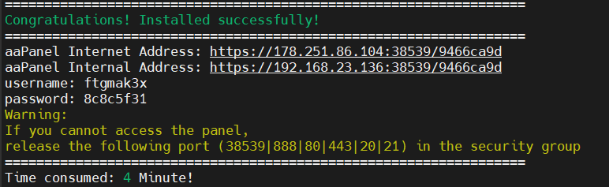

# Procédure de Déploiement

Décrivez ci-dessous votre procédure de déploiement en détaillant chacune des étapes. De la préparation du VPS à la méthodologie de déploiement continu.

## Préparation du VPS

J'ai commencé par me connecter en ssh avec l'identifiant et le mdp donné, puis j'ai rentré la commande aapanel : URL=https://www.aapanel.com/script/install_7.0_en.sh && if [ -f /usr/bin/curl ];then curl -ksSO "$URL" ;else wget --no-check-certificate -O install_7.0_en.sh "$URL";fi;bash install_7.0_en.sh aapanel

Il y avait ces informations à la fin de l'installation aapanel : 
aaPanel Internet Address: https://178.251.86.104:38539/9466ca9d
aaPanel Internal Address: https://192.168.23.136:38539/9466ca9d
username: ftgmak3x
password: 8c8c5f31

J'ai mis l'adresse dans google : https://192.168.23.136:38539/9466ca9d , et j'ai rentré les identifiants et j'ai installé nginx, php, phpmyadmin et mysql

## Méthode de déploiement

Sur la VM j'ai créé un fichier exam-deploy dans var : 
mkdir -p /var/exam-deploy
cd /var/exam-deploy
git init --bare deploy.git

mkdir -p /www/wwwroot/192.168.23.136
git --work-tree=/www/wwwroot/192.168.23.136 --git-dir=/var/exam-deploy/deploy.git checkout -f main
cd /www/wwwroot/192.168.23.136

J'ai changé le DB_PASSWORD="" avec le MDP donné par aapanel dans databases puis root password.
J'ai ensuite fait un composer install puis php bin/create-database.
J'ai changé dans domain manager danss aapanel, j'ai mis le domaine qu'on m'a donné frydman.dfs.lan