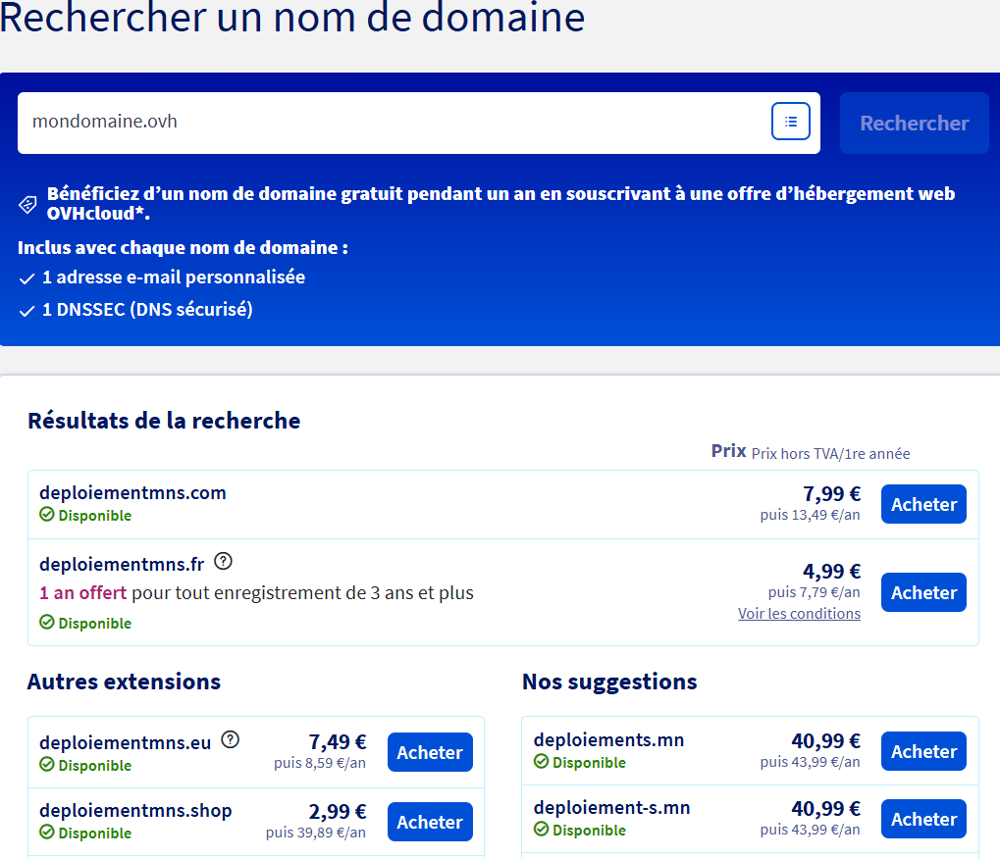

# Questions

Répondez ici aux questions théoriques en détaillant un maxium vos réponses :

1) Expliquer la procédure pour réserver un nom de domaine chez OVH avec des captures d'écran (arrêtez-vous au paiement) :
Il faut aller sur [ovhcloud.com](https://www.ovhcloud.com/fr/domains/). 
On peut rechercher si le nom de domaine voulu est déjà pris, s'il n'est pas pris OVH propose d'acheter le nom de domaine avec les extensions disponibles (.com, .fr, ...) 
Je recherche par exemple deploiementmns et ils me proposent plusieurs extensions différentes : .com, .fr, ...

En appuyant sur acheter on peut choisir le temps qu'on veut garder le nom de domaine puis ovh nous propose de lier un site web au domaine

2. Comment faire pour qu'un nom de domaine pointe vers une adresse IP spécifique ?
Il faut changer les paramètres dans l'hébergeur pour qu'il pointe vers l'adresse IP 

4. Comment mettre en place un certificat SSL ?
Il faut générer une demande de certificat CSR qui sont en 2 parties, une clé privée et clé publique.  
Il est possible de le générer avec un terminal Linux avec OpenSSL, avec une commande comme celle-ci on obtient 2 fichiers .key et .csr : ``openssl req -new -newkey rsa:2048 -nodes -out example_com.csr -keyout example_com.key -subj "/C=FR/ST=/L=Paris/O=Gandi/CN=www.example.com"``
On peut ensuite faire la demande à l'autorité de certification en envoyant
